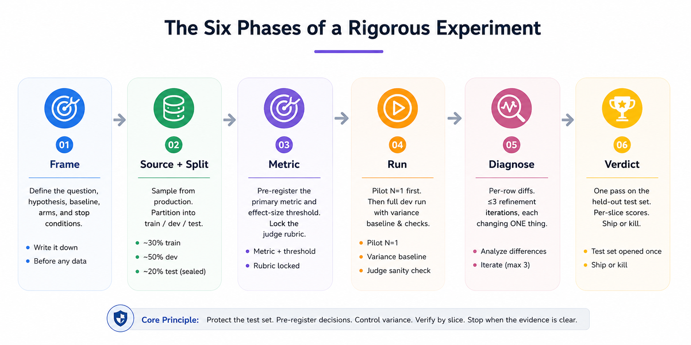

<div align="center">


# 🧪 auto-lab

<p><strong>Stop fooling yourself with AI evals.</strong></p>

<p><em>A Claude Code skill that turns "should we use X or Y?" into a rigorous experiment — with 22 built-in guards against the ways engineers accidentally lie to themselves.</em></p>

[](./LICENSE)
[](https://github.com/clfhaha1234/auto-lab/stargazers)
[](https://github.com/clfhaha1234/auto-lab/network)
[](https://docs.claude.com/en/docs/claude-code/skills)

</div>

## The problem

Every team shipping an LLM product asks the same questions:

- Should we switch from Sonnet to Opus?
- Is RAG actually helping, or is it just adding latency?
- Did that prompt tuning round move the needle, or did we overfit the eval?
- Why does production keep regressing after "winning" benchmarks?

Most teams answer them with vibes, eyeballed diffs, or benchmarks they've quietly tuned the system against. The result is always the same shape: a *"+12% improvement"* that drops 8% the week it hits production.

**Your eval is probably lying. You just don't know which way yet.**

`auto-lab` turns these decisions into rigorous experiments with built-in guards against leakage, cherry-picking, slice collapse, and benchmark gaming. Instead of vibe-based evals, you get a statistically grounded **ship-or-kill verdict in hours** — and a one-page conclusion doc that anyone can audit.

## What it catches

Five real failure modes, drawn from actual shipped-and-regressed AI products:

| What the team would have shipped | What `auto-lab` caught |
|---|---|
| *"Prompt v3 is +12% on eval. Ship it."* | v3's "improvement" came from rows the engineer read during debugging — test set was contaminated. Production regressed 8%. |
| *"GPT-4o beat Claude on our 50-row eval."* | Eval too small. The gap was 5pp, within-arm noise was 4pp. Not a real signal. |
| *"Aggregate accuracy up 6pp across all customers."* | One major tenant slice regressed -8pp. Aggregate winners are not winners when one slice loses. |
| *"Best-of-5 trial: 91% accuracy."* | Mean was 84% ± 4pp. Best-of-N is biased high by ~√log N. The team was reporting noise. |
| *"New rubric finally captures what matters."* | The rubric was rewritten *after* seeing scores. It happened to favor the arm they wanted to win. |

Each one is a specific anti-pattern with a specific safeguard. There are **22 in total**, listed in [SKILL.md](./SKILL.md).

## How it works

A six-phase scientific-method loop — with the test set sealed until the final verdict.



**01. Frame.** Write the question, hypothesis, baseline, arms, and stop conditions — on paper, before touching data.

**02. Source + Split.** Sample from production. Partition into ~30% train / ~50% dev / ~20% sealed test.

**03. Metric.** Pre-register the primary metric and effect-size threshold. Lock the LLM-judge rubric.

**04. Run.** Pilot N=1 first. Then full dev run with a variance baseline (≥3 trials) and a cross-judge sanity check on 5 dev rows.

**05. Diagnose.** Per-row diffs. ≤3 refinement iterations, each changing ONE thing.

**06. Verdict.** One pass on the held-out test set. Per-slice scores. Ship or kill — no re-runs.

Production data is the ground truth. Eval-set wins that don't survive a held-out test set are rejected before they ship.

## 22 anti-self-deception safeguards

The discipline is the product. A sample:

**Held-out test discipline.** Test set sealed until Phase 5. Opened once, no peeking, no re-runs.

**Pre-registered metric + threshold.** Locked in Phase 2. No post-hoc drift, no rubric edits after seeing scores.

**Pilot N=1 instrumentation check.** Catches null / placeholder metric fields in 30 seconds, before a 5-minute full run wastes the iteration.

**Variance-floor noise check.** Effect must clear **2× within-arm std**, not just the registered threshold — a 5pp win with 4pp noise is noise.

**Three-iteration cap on dev refinement.** Past iter 3 you're overfitting to dev. Each iter changes ONE thing.

**Per-slice verification.** Aggregate winners that lose on a major tenant slice are not winners. Either ship narrowly, or kill.

**Cross-judge sanity check.** Spot-check 5 rows with a different model family. Catches self-judging bias before it skews the verdict.

The full list — including the "common rationalizations" engineers reach for and the structural reasons each one fails — lives in [SKILL.md](./SKILL.md).

## Who this is for

Teams **shipping LLM products** who need to make decisions that affect production:

- Choosing between models when cost and accuracy both matter
- Validating a prompt change actually helps before deploying it
- Comparing retrieval strategies on real customer queries
- Auditing whether your eval methodology is biased

If you're a solo dev experimenting in a notebook, you can skip this. If you have customers depending on whether your AI decisions are right, you can't.

## Example output

A complete worked example lives at [`examples/prompt-tuning-classifier/`](./examples/prompt-tuning-classifier/) — three figures rendered from one `data.json`, telling one coherent teaching story.


> **Phase 3** — both candidate arms beat baseline by +8.9pp, well above the 2× variance noise floor.


> **Phase 5** — both arms clear the aggregate threshold. But `v3` regresses SMB tenants by -3.3pp, crossing the pre-registered loss floor. **Aggregate winner ≠ winner.**


> **Cost view** — `v2` is the Pareto move: +8.9pp at +$0.60 / 1k rows. Ship `v2`. Kill `v3`.

Every experiment ends with a one-page conclusion doc embedding these three charts and a discipline self-audit checklist. Code is throw-away; the conclusion is what compounds.

## The hard rules

**Never peek at the test set.** A single peek contaminates the row and biases your judgment of every neighbor.

**One thing per iteration.** Change two variables at once and you can't attribute the win.

**Falsification is finished.** When iter 3 disproves the hypothesis, lock the arm and run the test pass. Trying iter 4 is overfitting to dev.

**Aggregate wins don't override per-slice losses.** Either ship narrowly to the slice that wins, or kill.

**Lock the latest hypothesis-driven iter, not the highest-scoring one.** Picking by dev score is multi-iteration multiple-comparison bias.

These are a sample of the 22 forbidden moves the skill blocks. Full set in [SKILL.md](./SKILL.md).

## Quick Start

```bash
git clone https://github.com/clfhaha1234/auto-lab.git ~/.claude/skills/auto-lab
```

Then ask Claude any "should we use X or Y?" question:

> *"Compare prompt-v1, v2, v3 on this classifier."*
> *"Is Haiku 4.5 enough here, or do we need Sonnet?"*
> *"BM25, vector, or hybrid retrieval for this RAG?"*

Render charts manually:

```bash
uv run scripts/chart.py arm-bar          --data data.json --out charts/arm-bar.png
uv run scripts/chart.py forest-plot      --data data.json --out charts/forest-plot.png
uv run scripts/chart.py cost-vs-accuracy --data data.json --out charts/cost-vs-accuracy.png
```

PEP 723 inline deps — `uv run` provisions matplotlib automatically. `python3 scripts/chart.py …` also works.

## FAQ

**What is `auto-lab` actually doing?**
Enforcing the experimental discipline that AI teams know they should follow but skip because it's tedious. The skill makes Claude Code refuse the shortcuts — no test-set peeks, no rubric edits after seeing scores, no best-of-N reporting, no iter-4-because-I-feel-close. The 22 guards are the product. The charts are a side effect.

**Does this work with non-Claude models?**
Yes. The skill is model-agnostic — it tells Claude Code what discipline to enforce, but the arms you compare can be any models, any providers, any prompt / retrieval / architecture variants.

**Why three iterations max?**
Past iter 3 on the dev set, each "refinement" is overfitting to dev rather than finding signal. Empirically, iters 1–2 surface real bugs in the arm; iter 3 is hypothesis-driven; iter 4+ is metric-chasing dressed up as engineering.

**How is this different from a Jupyter notebook with matplotlib?**
A notebook lets you do anything — including all the things that quietly bias your conclusion. `auto-lab` forbids the specific moves that look reasonable but contaminate the verdict: peeking at test, picking best-of-N on test, moving the metric after the score, dropping rows that score badly. The discipline is what you can't get from a notebook.

**Can I use this on experiments I've already run?**
Use it on the *next* decision. For already-run experiments where the test set was peeked at during debugging, the test set is contaminated for that question — reseal from fresh production data before running `auto-lab` on it.

**Does the chart helper require Python?**
Yes. `scripts/chart.py` uses matplotlib via a PEP 723 inline-deps header — `uv run` provisions an isolated env automatically; `python3` works as fallback if matplotlib is already installed. The skill itself (the discipline + conclusion doc) works without Python.

## Contributing

Issues and PRs welcome. The highest-value contribution is a new entry to the *Common Rationalizations* table in [SKILL.md](./SKILL.md) from a real experience — the kind that ends *"…and we shipped it, and then production regressed."* Those are the stories the skill exists to prevent.

## License

[MIT](./LICENSE)
