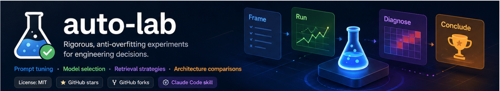
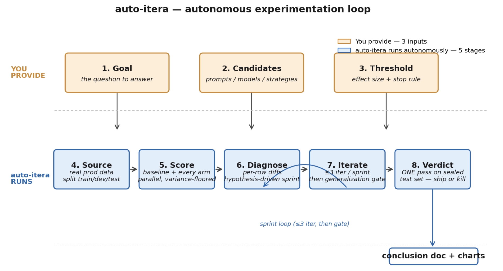
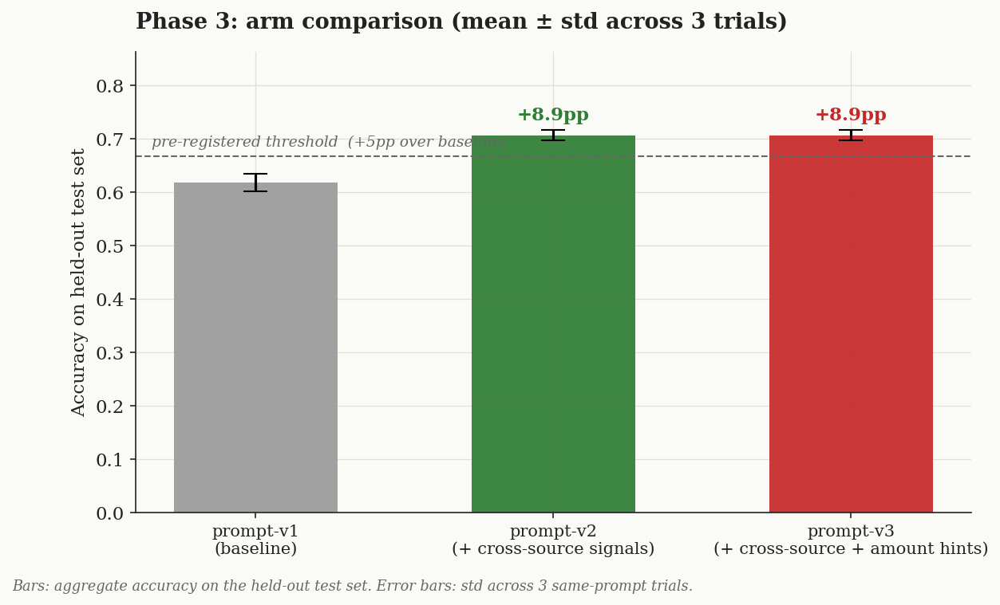
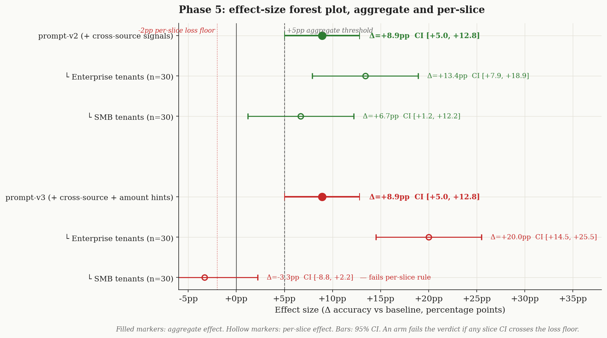
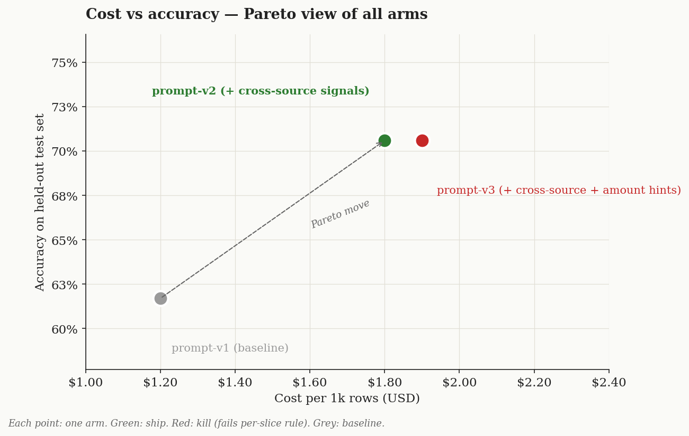

<div align="center">



# 🧪 auto-itera

<p><strong>Autonomous experimentation engine for AI engineering decisions.</strong></p>

<p><em>Define a goal. Give it the candidates. Get back a defensible ship-or-kill verdict in hours — sourced from real production data, scored across arms in parallel, sprint-iterated with discipline, and signed off on a sealed test set.</em></p>

[](./LICENSE)
[](https://github.com/clfhaha1234/auto-itera/stargazers)
[](https://github.com/clfhaha1234/auto-itera/network)
[](https://docs.claude.com/en/docs/claude-code/skills)

</div>

## From handcrafted trial-and-error to autonomous scientific search

Every team shipping an LLM product has decisions like these on the table:

- **Prompt optimization** — does the new system prompt actually beat the current one?
- **Model selection** — Sonnet, Haiku, or Opus for this hop?
- **Retrieval strategies** — BM25, dense, or hybrid on real customer queries?
- **Workflow tuning** — single-call vs two-call orchestration; sync vs queued?
- **Architecture experiments** — does adding a router LLM help or just add latency?

Today most teams answer these with vibes, eyeballed diffs, or notebooks they've quietly tuned the system against. `auto-itera` automates the rigorous version of this work: you state the goal, hand over the candidates, and the loop runs to a verdict you can defend in a code review.

## The loop



**You provide (3 inputs):**

1. **Goal** — the question you want answered ("does prompt-v2 beat v1 on classification?")
2. **Candidates** — the concrete arms to compare (a baseline + 1–3 alternatives)
3. **Threshold** — pre-registered effect size + per-slice loss floor ("ship if ≥5pp aggregate AND no slice regresses >2pp")

**`auto-itera` runs (5 autonomous stages):**

4. **Source** — sample real production data, stratify by tenant/class, split into train / dev / sealed test
5. **Score** — run baseline + every arm in parallel on dev, with variance baseline (≥3 trials) + cross-judge sanity check
6. **Diagnose** — per-row diffs against baseline, identify wins/losses by cluster, write a hypothesis for the next change
7. **Iterate** — sprint of up to 3 hypothesis-driven iterations, then a **generalization gate** that strips out dev-set memorization. Continue or lock.
8. **Verdict** — ONE pass on the sealed test set. Per-slice scores. Ship / scope narrowly / kill — with a conclusion doc and three publication-quality charts.

The output: a one-page conclusion doc embedding `arm-bar`, `forest-plot`, and `cost-vs-accuracy` figures, plus a discipline self-audit checklist. Code is throw-away; the conclusion is what compounds.

## Honest expectation boundary

> `auto-itera` automates the experimental **execution + iteration**. The evaluation **criteria** stay with you, by design.

**You provide (3 pre-registered inputs):**
- Candidate arms — the concrete prompts / models / strategies to compare
- Metric + judge — what counts as "better" and who scores it
- Threshold + per-slice loss floor — what counts as "ship-worthy"

**`auto-itera` auto-designs and runs (everything else):**
- Sampling strategy + train/dev/test splits sized to your effect threshold
- Parallel scoring with variance baseline + cross-judge sanity check
- Per-row diagnosis, hypothesis-driven sprints, generalization gate
- Held-out test pass + per-slice verdict + conclusion doc

The split is deliberate, not a capability gap. **A metric the system picks for itself is a metric the system can drift toward** — letting the evaluator design its own grading rubric is how teams accidentally ship +12% benchmark wins that regress 8% in production. Pre-registration is the discipline that keeps the verdict trustworthy.

Think of it as **an autonomous experiment runner, not an autonomous AI scientist that invents the hypothesis AND grades it**.

## Why a sprint-and-generalize loop

The most interesting design choice is in stage 7. Naive "iterate until it looks better" optimizes the dev set — every refinement that doesn't survive the held-out test is overfitting in a lab coat. A flat "stop after 3 iterations" rule prevents that, but it also blocks legitimate deeper exploration.

`auto-itera` splits the difference:

```
iterate × up to 3
   ↓
generalization gate
   ↓
   ├──  every change is a universal mechanism (or got promoted to one) → start next sprint
   ├──  dev signal saturated → lock and run the test pass
   └──  changes were mostly "if input X return Y" hardcodes → kill this arm
```

The 3 inside a sprint is a working-memory cap (humans can't reliably attribute outcomes across more than ~3 simultaneous hypothesis edits). The gate between sprints separates **principled iteration** (finding deeper mechanisms) from **dev-set memorization** (adding rules that win specific rows but won't survive the test).

Most decisions converge in 1–2 sprints. Past 3 sprints, the prior shifts toward "the gate is failing to catch dev-memorization" — the right move is to audit the gate, not to keep iterating.

## Safeguards — the 22 ways auto-itera refuses to lie to you

Autonomy without honesty is a worse outcome than vibes-based evals — at least vibes don't pretend to be science. `auto-itera` ships with 22 explicit safeguards that block the specific moves that look reasonable but contaminate the verdict.

Five real failure modes, drawn from actual shipped-and-regressed AI products:

| What the team would have shipped | What `auto-itera` caught |
|---|---|
| *"Prompt v3 is +12% on eval. Ship it."* | The "improvement" came from rows the engineer read during debugging. Test set was contaminated. Production regressed 8%. |
| *"GPT-4o beat Claude on our 50-row eval."* | Eval too small. Gap was 5pp, within-arm noise was 4pp. Not a real signal. |
| *"Aggregate accuracy up 6pp across all customers."* | One major tenant slice regressed -8pp. Aggregate winners are not winners when a major slice loses. |
| *"Best-of-5 trial: 91% accuracy."* | Mean was 84% ± 4pp. Best-of-N is biased high by ~√log N. |
| *"New rubric finally captures what matters."* | Rubric was rewritten *after* seeing scores. It happened to favor the arm they wanted to win. |

Each one is a specific anti-pattern with a specific safeguard. Other guards include held-out test sealing, pre-registered metrics, variance-floor noise checks, the generalization gate, cross-judge sanity checks, and a per-slice loss floor. The full list — plus a "Common Rationalizations" table cataloging the excuses engineers reach for in the moment — lives in [SKILL.md](./SKILL.md).

## How it fits in

Several solid tools exist for *running* evals — [Promptfoo](https://promptfoo.dev), [Inspect](https://inspect.aisi.org.uk), [LangSmith Evals](https://docs.smith.langchain.com), [OpenAI Evals](https://github.com/openai/evals). They give you the numbers. `auto-itera` is built for what comes *after* the numbers — the discipline that prevents the numbers from lying to you.

| What's unique to `auto-itera` | Why it matters |
|---|---|
| **Held-out test sealed + metric pre-registered** by default | "saw the score, edited the metric, re-ran" is structurally forbidden, not just discouraged |
| **Sprint + generalization gate** between iteration rounds | strips dev-set memorization before each new sprint; iter-3 hardcodes get rejected before they reach the test set |
| **Per-slice loss floor** | aggregate winner that regresses a major tenant slice is rejected automatically — no aggregate-winner-ships-and-quietly-breaks-SMB story |
| **One-shot test pass** | the sealed test set opens ONCE; conclusion doc + 3 charts + discipline self-audit is the output |
| **Runs inside Claude Code** | no separate CLI / dashboard to maintain; `git clone` and ask a question |

**The other tools all support pieces of this opt-in.** `auto-itera`'s value is making the discipline the default — and refusing to let you skip it mid-flight when the dev-set scores look exciting.

If you need a hosted eval dashboard with prompts in a UI, use LangSmith. If you need pre-built safety benchmarks, use Inspect. **If you need a defensible ship-or-kill verdict on real production data in the next afternoon, that's `auto-itera`'s lane.**

## Example output

A complete worked example lives at [`examples/prompt-tuning-classifier/`](./examples/prompt-tuning-classifier/) — three figures rendered from one `data.json`, telling one coherent teaching story.



> **Stage 5** — both candidate arms beat baseline by +8.9pp, well above the 2× variance noise floor.



> **Stage 8** — both arms clear the aggregate threshold. But `v3` regresses SMB tenants by -3.3pp, crossing the pre-registered loss floor. **Aggregate winner ≠ winner.**



> **Cost view** — `v2` is the Pareto move: +8.9pp at +$0.60 / 1k rows. Ship `v2`. Kill `v3`.

## Who this is for

Teams **shipping LLM products** who need decisions that survive production:

- Choosing between models when cost and accuracy both matter
- Validating a prompt change actually helps before deploying it
- Comparing retrieval strategies on real customer queries
- Auditing whether your eval methodology is biased

If you're a solo dev experimenting in a notebook, you can skip this. If you have customers depending on whether your AI decisions are right, you can't.

## Quick Start — your first experiment in 5 minutes

### 1. Install

```bash
git clone https://github.com/clfhaha1234/auto-itera.git ~/.claude/skills/auto-itera
```

That's it. `auto-itera` is now a Claude Code skill. No other dependencies until you want to render charts standalone.

### 2. Open Claude Code in any project and paste a real comparison question

The format that triggers the skill cleanly: state the **goal**, spell out the **candidates** (baseline + 1–3 alternatives), and **pre-register the threshold** before any data is sampled.

> *I want to evaluate two versions of my classifier system prompt.*
>
> *Baseline (`prompt-v1`): current production prompt at `src/classify/processor.ts:42`.*
> *Candidate (`prompt-v2`): same prompt + an extra sentence: "When the input mentions a payment processor (Stripe, PayPal, Square), classify as 'fees' not 'transfer'."*
>
> *I have ~200 real production rows in `data/classifier-eval.csv` with human-labeled ground truth in the `expected_label` column. About 60% are enterprise tenants and 40% SMB.*
>
> *Ship criterion: ≥+5pp aggregate accuracy AND no per-tenant slice regresses more than -2pp.*

### 3. Watch the autonomous loop run

`auto-itera` does the rest:

1. **Writes the Phase 0 frame** as a markdown table — your question, the two arms, the metric, the threshold. Asks ONCE if anything's wrong; otherwise locks it.
2. **Splits your 200 rows** stratified by tenant tier — ~60 train / ~100 dev / ~40 sealed test. Prints a distribution audit so the split matches your prod traffic mix.
3. **Runs a 1-row pilot** to catch instrumentation bugs before the full run wastes 5 minutes.
4. **Scores baseline + v2 in parallel** on dev. Reports aggregate + per-slice + variance (≥3 trials per arm). Cross-judge sanity check on 5 rows with a 2nd-family model.
5. **Sprint, if needed** — up to 3 iterations of "diagnose per-row → hypothesis → tweak the arm → re-score". Generalization gate strips dev-set memorization. Continue or lock.
6. **One pass on the sealed test set.** Per-slice scores. Verdict: ship `v2`, ship narrowly to one slice, or kill.
7. **Writes the conclusion doc** to `docs/experiments/YYYY-MM-DD-<topic>/` — three publication-quality charts embedded, full discipline self-audit checklist signed off.

Wall clock on a 200-row dataset: typically **5–15 minutes**. Most of that is LLM scoring; Claude's thinking is a tiny fraction.

### 4. What you don't need

- No API keys to configure (uses whatever Claude Code already has)
- No separate dashboard / hosted service
- No YAML config files
- No Python (unless you want to render charts standalone — see below)

### Optional: re-render charts from a saved data.json

If you want to regenerate the three figures from an already-completed experiment's `data.json`:

```bash
uv run scripts/chart.py arm-bar          --data data.json --out charts/arm-bar.png
uv run scripts/chart.py forest-plot      --data data.json --out charts/forest-plot.png
uv run scripts/chart.py cost-vs-accuracy --data data.json --out charts/cost-vs-accuracy.png
```

Re-render the loop diagram in this README (if you fork and want a customized version):

```bash
uv run scripts/render-loop-diagram.py --out docs/images/autonomous-loop.png
```

PEP 723 inline deps — `uv run` provisions matplotlib automatically. `python3 scripts/*.py …` also works if matplotlib is already installed.

## FAQ

**What is `auto-itera` actually doing?**
Running the experimental discipline that AI teams know they should follow but skip because it's tedious. You hand it a goal + candidate arms + success threshold; it sources real production data, scores baseline + arms in parallel, diagnoses per-row, sprints with a generalization gate between rounds, picks the latest gate-passed iter, and runs the held-out test pass. The 22 safeguards make the discipline mechanical; the charts are a side effect; the verdict is the product.

**Why "autonomous experimentation" and not "AI scientist"?**
Because the skill autonomously runs experiments — it does not autonomously invent hypotheses or brainstorm what to test. The human (or Claude in conversation with the human) supplies the candidate arms; `auto-itera` runs the loop from there to verdict. Calling it an "AI scientist" would oversell what it does and undersell what it does well: turning a vague "should we use X or Y?" question into a defensible verdict in hours.

**Why doesn't auto-itera pick its own metric?**
By design. A metric the system picks for itself is a metric the system can drift toward — and "the model that scored highest on the metric the model designed" is exactly how teams accidentally ship +12% benchmark wins that regress 8% in production. Pre-registering the metric, threshold, and judge rubric BEFORE any data is sampled is the discipline that keeps the verdict trustworthy. The skill auto-designs the *experimental execution* (sampling, splits, variance trials, slicing, gating); you lock the *evaluation criteria* upfront. Splitting these responsibilities is what separates rigorous evaluation from automated self-confirmation.

**Does this work with non-Claude models?**
Yes. The skill is model-agnostic — it tells Claude Code what discipline to enforce, but the arms you compare can be any models, any providers, any prompt / retrieval / architecture variants.

**Why a 3-iteration sprint cap, not a hard "stop at 3" rule?**
3 is a working-memory cap — humans can't reliably attribute outcomes across more than ~3 simultaneous hypothesis edits inside a single sprint. But iteration itself isn't the enemy; *un-audited* iteration is. After each sprint, the generalization gate strips out dev-set memorization. If the gate passes and dev signal isn't saturated, you start a fresh sprint. Most decisions converge in 1–2 sprints. Past 3 sprints, the prior shifts toward "the gate is failing to catch dev-memorization" — and the right move is to audit the gate, not to keep iterating.

**How is this different from a Jupyter notebook with matplotlib?**
A notebook lets you do anything — including all the things that quietly bias your conclusion. `auto-itera` makes the discipline mechanical: forbids peeking at test, forbids picking best-of-N on test, forbids moving the metric after the score, forbids skipping the generalization gate between sprints. The discipline is what you can't get from a notebook.

**Can I use this on experiments I've already run?**
Use it on the *next* decision. For already-run experiments where the test set was peeked at during debugging, the test set is contaminated for that question — reseal from fresh production data before running `auto-itera` on it.

**Does the chart helper require Python?**
Yes. `scripts/chart.py` and `scripts/render-loop-diagram.py` use matplotlib via a PEP 723 inline-deps header — `uv run` provisions an isolated env automatically; `python3` works as fallback if matplotlib is already installed. The skill itself (the discipline + conclusion doc) works without Python.

## Contributing

Issues and PRs welcome. The highest-value contribution is a new entry to the *Common Rationalizations* table in [SKILL.md](./SKILL.md) from a real experience — the kind that ends *"…and we shipped it, and then production regressed."* Those are the stories the skill exists to prevent.

## License

[MIT](./LICENSE)
