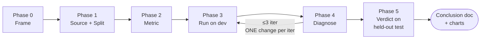

<div align="center">

# 🧪 auto-lab

<p><em>Rigorous, anti-overfitting experiments for engineering decisions.</em></p>

<p>Prompt tuning · model selection · retrieval strategies · architecture comparisons.</p>

[](./LICENSE)
[](https://github.com/clfhaha1234/auto-lab/stargazers)
[](https://github.com/clfhaha1234/auto-lab/network)
[](https://docs.claude.com/en/docs/claude-code/skills)

</div>

## ⚡ Why

Most engineering experiments leak. You peek at the test set. You pick best-of-N on the same set you report from. You tune prompts on the rows the LLM got wrong. Each move looks reasonable; together they make the conclusion look like science while generalizing worse than a coin flip.

> **`auto-lab` is the discipline that closes the leaks** — scientific method applied to fast-moving AI engineering decisions.

## 🔄 The six phases



| Built-in discipline | |
|---|---|
| Held-out test set | Sealed until Phase 5. Opened **once**. |
| Pre-registered metric + threshold | Locked in Phase 2. No drift. |
| Pilot N=1 | Before any full run. Catches instrumentation bugs in 30 seconds. |
| Variance baseline | Effect must be ≥ 2× within-arm noise. |
| 3-iteration cap | Past that you're overfitting to dev. |
| Per-slice verification | Aggregate winners that lose on a major slice are not winners. |

## 📊 Example output

A complete worked example lives at [`examples/prompt-tuning-classifier/`](./examples/prompt-tuning-classifier/). Three figures rendered from one `data.json`, telling one coherent teaching story.


> **Phase 3** — both candidate arms beat baseline by +8.9pp, well above the 2× variance noise floor.


> **Phase 5** — both arms clear the aggregate threshold. But `v3` regresses SMB tenants by -3.3pp, crossing the pre-registered loss floor. **Aggregate winner ≠ winner.**


> **Cost view** — `v2` is the Pareto move: +8.9pp at +$0.60 / 1k rows. Ship `v2`. Kill `v3`.

## 🚀 Quick start

```bash
git clone https://github.com/clfhaha1234/auto-lab.git ~/.claude/skills/auto-lab
```

Then ask Claude any "should we use X or Y?" question:

> *"Compare prompt-v1, v2, v3 on this classifier."*
> *"Is Haiku 4.5 enough here, or do we need Sonnet?"*
> *"BM25, vector, or hybrid retrieval for this RAG?"*

Render charts manually:

```bash
uv run scripts/chart.py arm-bar          --data data.json --out charts/arm-bar.png
uv run scripts/chart.py forest-plot      --data data.json --out charts/forest-plot.png
uv run scripts/chart.py cost-vs-accuracy --data data.json --out charts/cost-vs-accuracy.png
```

PEP 723 inline deps — `uv run` provisions matplotlib automatically. `python3 scripts/chart.py …` also works.

## 🧠 Forbidden moves

A sample of the 22 rationalizations the skill explicitly blocks. Full set in [SKILL.md](./SKILL.md).

| Anti-pattern | Why it's bad |
|---|---|
| Tune prompts by reading test-set rows the LLM got wrong | Training on test → real-world regression |
| Try N prompts, pick best by test score | Multiple-comparison bias |
| Run 10 trials, report best | Cherry-picking noise |
| Move the metric after seeing the score | The metric was wrong, not the score |
| Add LLM-judge rubric items that favor your arm | Judge biased toward your desired conclusion |
| Iter 3 falsified the hypothesis — let me try iter 4 | Falsification is a finished iteration |

## 🌍 What you can use this for

| Decision | Example question |
|---|---|
| Prompt tuning | "Does prompt-v2 beat baseline across both tenant tiers?" |
| Model selection | "Can we downgrade from Opus to Haiku without losing accuracy?" |
| Retrieval strategy | "Hybrid vs vector-only vs BM25-only?" |
| Architecture choice | "One-call vs two-call orchestration?" |
| Eval methodology | "Same-family vs cross-family judge — which is more honest?" |

Anything phrased as **"should we use X or Y in production?"** with a ship-or-kill decision needed within ~1 day.

## 🤝 Contributing

Issues and PRs welcome. Highest-value contribution: a new entry to the *Common Rationalizations* table from a real experience.

## License

[MIT](./LICENSE)
