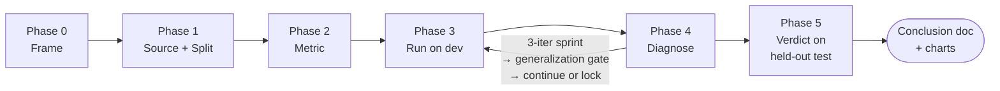

# Auto Itera

## Overview

A disciplined experimental-comparison loop: **Frame → Source → Metric → Run → Diagnose → Conclude**. The pivot is **scientific method applied to engineering decisions**: hypothesis-first, baseline + arms, real production data, held-out test set, sprint-and-generalize refinement (not unbounded iteration, not arbitrary hard caps).



**Core principle:** *Conclusions must come from data the experiment didn't tune on.* Anything else is overfitting wearing a science costume.

## When to Use

- Competing implementation choices ("should we use 2 LLMs or 1?", "Sonnet or Haiku?", "this prompt or that?")
- Production behavior is the ground truth (not synthetic benchmarks)
- The win must generalize, not just look good on cherry-picked examples
- A "ship or kill" decision is needed within ~1 day

## When NOT to Use

- Decision can be made from first-principles reasoning alone (e.g., "this code path is wrong because it ignores `resetAt`") — just fix it
- No real production data available (synthetic-only experiments are weaker than thoughtful design)
- The arms are mechanically the same (e.g., "v1.0 prompt vs v1.0 prompt with whitespace edits") — you have nothing to test

## The Six Phases

### Phase 0 — Frame the question (BEFORE touching data)

Write down, on paper:

| Field | Example |
|---|---|
| **Question** | "Is splitting `runCleanup` into decision-LLM + generation-LLM better than the current single-call approach?" |
| **Hypothesis** | "Two-step is better when missed rows mostly fit existing questions (cheap decision call short-circuits expensive generation)." |
| **Baseline** | Current production behavior, exactly as deployed. Not a strawman. Reference the file:line. |
| **Arms** | 1-3 concrete alternatives. Each must change ONE thing vs baseline. If you change two things you can't attribute the win. |
| **Stop conditions** | "Arm wins if ≥X effect size on test set AND not overfit (per Phase 4 audit). Otherwise kill." |

**Lock these before collecting data.** Decisions made AFTER seeing scores are how p-hacking happens.

### Phase 1 — Source data + split

**Source from production whenever possible.** Real customer rows + real prod state. Synthetic data underestimates the long tail.

| Set | Size | Purpose | Examined? |
|---|---|---|---|
| **Train / scratch** | ~30% | Develop arms, debug prompts, look at examples | freely |
| **Dev** | ~50% | Score iterations during Phase 3-4 | scores only — never read raw rows to tune |
| **Test (held-out)** | ~20% | Final verdict in Phase 5 | NEVER opened until Phase 5; ONE pass only |

**Hard rule:** Once you've seen a test-set row, it's contaminated. Move it to dev and reseal a fresh test set. No exceptions.

For small N (<50 rows total): use stratified k-fold on dev instead of a fixed split. Keep the test set sealed regardless.

**Sampling philosophy — reflect, don't sanitize.** When deduping by vendor / topic / class, the goal is to *reflect the production distribution*, not to maximize uniqueness. If real customers see the same vendor 3× / month, the dataset should too. Per-vendor cap of 1 is almost always wrong — it tests "novel" decisions only and misses how the system handles repetition. Default cap: ~3 rows per vendor, ~1/3 of total dataset per single dominant vendor max.

**Sizing heuristic.** Aim for N where you can detect the smallest effect you'd act on:

| Pre-registered effect threshold | Min total N (rough) | Reasoning |
|---|---|---|
| ≥10pp absolute | ~30 | Tail risk small; even small N catches obvious wins/losses |
| ≥5pp absolute | ~80 | Within-judge variance often ~3-5pp; need 2-3× that to see signal |
| ≥2pp absolute | ~300+ | Below judge noise floor unless judge is extremely consistent |

**Cheap tax**: prod data is ample for most decisions. If your dataset feels small, ask why first — usually a too-aggressive dedupe rule or a stratification that drops the actual long tail.

**Distribution audit BEFORE Phase 3.** Once split is done, print per-class / per-tenant counts and compare against production reality:
- "SodaGift conf=2 should have ~30 rows in prod; my sample has 0" → dedupe ate them, repair the sampler
- "BTC has 2× the rows of Sodagift but Sodagift has 100× more prod traffic" → re-stratify
- The system you're testing operates on prod's distribution, not the sampler's. **Mismatch here = experiment tests the wrong thing**, no amount of careful Phase 4 fixes that.

### Phase 2 — Define metric (before any run)

**One primary metric. Maybe two secondaries.** More metrics = more knobs to cherry-pick.

The metric should:
1. **Map to the real-world stake** ("is the customer's question merged into the right group?", not "did the LLM emit valid JSON?")
2. **Be computable per-row, not just aggregate** — per-row diffs are where signal lives
3. **Have a known baseline value** before the experiment starts (compute baseline-on-dev first, write it down)
4. **Have a meaningful effect-size threshold** ("≥5pp absolute" or "≥10% relative") — pre-registered, not chosen after

If the metric requires LLM-judge: define the rubric BEFORE seeing arm output. Otherwise the rubric drifts to favor whichever arm reads better.

### Phase 3 — Run on dev (baseline + arms in parallel)

**Pilot run first (N=1).** Before launching all arms × all rows, run baseline + each arm on **ONE row from train** and **read every output by eye**:
- Did each arm produce a sensible decision shape?
- Are all metric fields populated (not null, not placeholder strings)?
- Are cost + latency + token counts captured for *every* arm, including baseline?
- Does the judge see the actual reasoning text, not a stub like `"(runCleanup single call)"`?

If any field is null or placeholder for any arm → **stop, fix instrumentation, repeat pilot**. The cost of rerunning N=1 is seconds. The cost of discovering an instrumentation bug after a 55-row × 3-arm × 5-min run is the entire iteration. **This is the single highest-leverage rule in this skill.**

Run all arms (baseline + N variants) against the same dev set. Same inputs, same evaluator, same versions. Capture:

- Aggregate score per arm
- **Per-row scores** (so Phase 4 can diff)
- LLM cost + latency per row (often as important as accuracy)
- Variance across runs if non-deterministic (≥3 trials, report mean ± stdev)

**Variance baseline (the noise floor).** Before celebrating any score gap, establish the within-arm variance:
- Run baseline on the same dev set 3× **with no code change between runs**. Record mean ± stdev.
- If two arms share an identical sub-call (e.g. same step-1 prompt under different step-2 strategies), their disagreement on those calls IS your variance estimate — log it.
- **Effect must be ≥ 2× variance to count.** A 5pp gap with 4pp within-arm noise is noise.
- Cross-iter score differences for the SAME unchanged arm are NOT a valid variance estimate (the prompt may have changed indirectly via cache state, judge mood, etc.). Run dedicated repeats.

**Cache-warmed cost.** Anthropic prompt cache writes cost ~1.25× input tokens; reads cost ~0.1×. The first call after a 5-min idle pays full write cost; calls 2-N (within 5min) pay read cost. **Single-row cost figures are misleading 5-15× both ways.** Use the steady-state average across the full N rows, not the first row.

**Cross-judge sanity check (mitigate self-judging bias).** When the judge is the same provider/family as some arm (e.g. Sonnet judging Claude-built arms), there's systematic bias risk. Cheap mitigation: spot-check **5 dev rows with a second judge** (different model family — Gemini, GPT, GLM). If the two judges agree on ranking direction (which arm beat which) on ≥4/5 rows, primary judge is trustworthy enough. If they disagree on ≥2/5, the metric is too subjective for a single-judge experiment — restart Phase 2 with a more objective rubric or human labels.

**No stopping early.** Even if arm A is winning at 30% of rows, finish all rows so Phase 4 sees the full distribution.

### Phase 4 — Diagnose + refine (sprint-and-generalize loop)

Look at **per-row diffs** between baseline and each arm:

| Pattern | Diagnosis | Refinement |
|---|---|---|
| Arm wins on cluster X, loses on cluster Y | Mixed regime — investigate Y | Refine arm OR scope the claim ("ship for X, not Y") |
| Both fail on same rows | Hard cases or label noise | Audit the labels; not an arm problem |
| Arm wins by a small margin uniformly | Likely noise | Run more trials before concluding |
| Arm wins big on rows you already saw | Overfit to scratch | Flag — Phase 5 will likely regress |

**The refinement structure is sprint → gate → (continue or lock), not "iterate freely" and not "stop at 3 no matter what."**

A **sprint** is up to **3 consecutive dev-set iterations**. Each iteration changes ONE thing in the arm, starts with a written hypothesis, and ends with a verdict (supported / neutral / falsified). The 3 inside a sprint is a working-memory cap — humans cannot reliably attribute outcomes when more than ~3 hypotheses are in flight simultaneously.

When a sprint ends (3 iterations done, OR hypothesis falsified, OR signal saturated on dev), you must pass the **generalization gate** before starting a second sprint.

#### The generalization gate

List every change introduced during the sprint (prompt edit, rule add, threshold tweak, etc.). For each one ask:

> **Is this a `if input matches X return Y` rule that wins specific dev rows? Or is it a universal mechanism that would have been written even if you'd never seen those rows?**

| Change type | What to do |
|---|---|
| **Hardcode-to-pass-specific-rows** ("if vendor is Stripe, force category=processor") | Upgrade to first-principles statement ("payment processors share GL category Y because <structural reason>") OR delete the change OR convert to a deterministic table/unit test outside the arm |
| **Universal mechanism** ("ask the model to consider amount sign before classifying") | Keep — this generalizes |
| **Can't tell yet** | Treat as hardcode until proven otherwise; the burden of proof is on "this generalizes" |

Pass criteria for the gate:
- ✅ Every sprint change is either (a) universal mechanism that survives the audit, or (b) lifted out of the arm into a deterministic component, or (c) deleted
- ✅ The arm at sprint-end is describable as a small set of mechanisms, not a list of "if vendor X, do Y" rules
- ✅ Dev-set signal is **not yet saturated** — there are still per-row failures that the next sprint could plausibly explain with a new mechanism (not by adding more hardcodes)

If all three pass → start the next sprint with a fresh hypothesis.
If gate fails because changes are mostly hardcodes → **kill this arm**; the apparent wins were dev-set memorization.
If gate passes but dev signal is saturated → **lock and run Phase 5**; further iteration is metric-chasing.

**Sprint-count guidance.** Most decisions converge in 1–2 sprints (3–6 iterations). Three sprints (9 iterations) is rare and should make you suspicious you're optimizing dev. Past 3 sprints, the prior shifts strongly toward "this arm isn't actually better; the gains are dev-memorization that the gate is failing to catch." Audit the gate harder, don't keep iterating.

**If iteration 2 of a sprint finds nothing new**, you're not looking hard enough at per-row diffs. Read more diffs before concluding signal is saturated.

**Each iteration changes ONE thing in the arm.** If iter3's prompt change adds "options + samples + amount-direction hint" all at once and the arm regresses, you can't tell which of the three caused it. Split into iter3a/3b/3c if you need 3 dimensions tested — but that's 3 iterations spent on one decision dimension and the sprint ends after it. Better: pick the highest-leverage single change, isolate, judge.

**Falsification is a first-class outcome.** Each iteration begins with a written hypothesis ("more context → fewer wrong attaches"). After scoring, the hypothesis is either supported, neutral, or **falsified** (the change made things worse). Falsification ends the iteration and may end the sprint — log it, run the gate, then decide whether to start a new sprint with a different hypothesis or lock and run Phase 5. The pull "let me just try one more thing" inside the same sprint is the failure mode the sprint cap exists to block — finish the sprint, gate it, then decide.

**Locking for Phase 5: lock the latest hypothesis-driven iter that passed the gate, NOT the highest-scoring iter.** If iter5's score is lower than iter3's but iter5 reflects the most recent gate-passed mechanism, lock iter5. Cherry-picking "iter3 had a higher number, lock that one for test" is multi-iteration multiple-comparison bias — best-of-N across iters is biased high by O(σ × √log N). Don't do it.

### Phase 5 — Final verdict (ONE pass on test set)

After arms are locked from Phase 4:

1. Run baseline + locked arms on the held-out test set, ONCE.
2. Apply pre-registered effect-size threshold from Phase 0.
3. **Verify per-slice, not just aggregate**: if Phase 0 promised the verdict on per-tenant slices, also report per-slice scores. Aggregate winners that lose on a major slice are NOT winners — either ship narrowly ("for tenant X only") or kill.
4. Write the conclusion in one paragraph, citing the test-set numbers.

**Do not iterate after Phase 5.** If the test result doesn't support shipping, the conclusion is "kill" or "needs more design," not "let me tweak and re-run." Re-running on test = test set is now contaminated for this question.

## First-Principles Anti-Overfitting Guards

**Forbidden moves** — these are how engineers accidentally lie to themselves:

| Anti-pattern | Why it's bad | What to do instead |
|---|---|---|
| Add `if input matches X, return Y` rules to win specific test cases | The system doesn't generalize; deployment will regress on similar-but-not-identical input | If a rule is universally true ("Plaid `category=transfer` is always internal"), promote it to a first-principles claim and write a unit test instead |
| Tune the prompt by reading the rows the LLM got wrong on test | Training on test → biased upward → real-world regression | Move those rows to dev. Reseal test from new prod data. |
| Try N prompts, pick best by test-set score | Multiple-comparison bias: best-of-N is biased high by O(σ × √log N) | Pick on DEV. Run only locked winner on test. |
| Run 10 trials, report best | Cherry-picking noise | Report mean ± stdev across all trials |
| Move the metric after seeing the score | The metric was wrong to begin with, not the score | If the metric truly was wrong, restart Phase 0 with fresh data |
| Add LLM-judge rubric items that happen to favor your arm | Judge is now biased toward the conclusion you wanted | Lock rubric in Phase 2 before running |

**The litmus test** for any rule/heuristic: *would I add this rule if I had never seen a single test case?* If the answer is no, you're overfitting.

## Common Rationalizations

| Excuse | Reality |
|---|---|
| "I'll just peek at one test row to understand what's happening" | One peek contaminates the row + biases your judgment of nearby rows. Move it to dev or reseal. |
| "The test set is small, so I need to look at every row to be sure" | Small test sets give noisy results. Either accept noise or get more data — don't trade test discipline for false confidence. |
| "I added the rule because the LLM keeps getting Vendor X wrong" | If Vendor X has a structural reason to classify as Y, write the structural reason in the prompt (or as a deterministic VP entry). Don't hardcode Vendor X. |
| "Three iterations isn't enough, I'm close to a breakthrough" | Finish the sprint, run the generalization gate. If the gate passes AND dev signal is unsaturated, start a new sprint with a fresh hypothesis. If you can't articulate a fresh hypothesis or every change in the last sprint was a hardcode, the "breakthrough" was dev-memorization. |
| "I'll skip the generalization gate this once, the changes are obviously general" | The gate is 10 minutes. The cost of one sprint's worth of dev-memorization leaking into the next sprint is the whole rest of the experiment. Always gate. |
| "Real prod data is too noisy, let me use synthetic" | Real prod noise IS the test. Synthetic underestimates the tail your customers actually hit. |
| "Best-of-3 is fine, the variance is small" | If variance is small, mean and best agree. Report mean anyway — keeps you honest. |
| "Pilot run is overkill, the runner looks right" | Pilot N=1 takes 30s and catches null/placeholder fields before a 5-min full run. Always pilot. Untested instrumentation = wasted iteration. |
| "Iter2's score is higher, lock that one for test" | That's multi-iteration multiple-comparison bias. Lock the LATEST hypothesis-driven version, even if score is lower. |
| "I'll dedupe by vendor so each row is unique" | Real customers see the same vendor 3× / month. Per-vendor cap of 1 tests novelty only — misses the bulk of how the system actually behaves. |
| "Iter3 falsified my hypothesis — let me try iter4" | 3-iter cap is the discipline. Falsification is a finished iteration. Lock and run test. |
| "Cost looked low when I tested 1 row" | First call pays cache-write (1.25× input). Steady-state cost across the full N is 5-15× different. Use the average, not the first row. |
| "Same model judging same model is fine, the rubric is locked" | Locked rubric reduces but doesn't eliminate self-judging bias. Spot-check 5 rows with a 2nd-family judge. Cheap insurance. |
| "Sample distribution roughly matches prod, close enough" | "Roughly" hides systematic class drops. Print actual per-class counts and compare numbers, not vibes. |
| "I changed 3 things in iter3 but they're all related" | If they were really 1 thing you'd write 1 line of prompt. 3 lines = 3 dimensions = confounded. Pick the highest-leverage one and isolate. |
| "Aggregate score wins, ship it" | Aggregate winners that lose on a major slice are not winners. Always check per-tenant / per-class slice scores at Phase 5. |

## Red Flags — STOP

- About to read a test-set row to debug an arm
- Refining an arm based on something seen on test
- Adding a hardcoded rule that wasn't in the Phase 0 hypothesis
- Score gap between dev and test > 2× the within-set variance (overfit alarm)
- About to start a 4th iteration inside the same sprint (sprint cap is 3 — finish, gate, then decide if a new sprint is warranted)
- About to start a new sprint without running the generalization gate on the prior sprint
- About to start a 4th sprint (very high prior that gains are dev-memorization the gate is failing to catch)
- "Let me just try one more thing" inside an already-finished sprint
- About to start full dev run **without** running a 1-row pilot first
- Reporting cost from a first-call (cache-cold) measurement
- Comparing arms whose score gap is < 2× variance (likely noise)
- About to "lock the iter with best dev score" instead of the latest hypothesis-driven iter

**All of these mean: STOP, return to Phase 5 with current arms, write the conclusion.**

## Visualization Output

After Phase 3 and Phase 5, generate the canonical figures via `scripts/chart.py`. The helper reads a single `data.json` (per-arm aggregates, per-slice break-down, variance trials, cost) and renders three publication-quality PNGs:

| Chart | Phase | Purpose |
|---|---|---|
| `arm-bar` | 3 | Per-arm aggregate score with variance error bars; pre-registered threshold drawn as a dashed reference line. |
| `forest-plot` | 5 | Per-arm effect size with 95% CI plus per-slice break-down. Aggregate threshold + per-slice loss floor drawn as reference lines; any slice whose CI crosses the loss floor renders in red. |
| `cost-vs-accuracy` | 3-5 | Cost vs accuracy Pareto scatter across all arms. |

Invocation (uv reads the script's PEP 723 inline-deps header and provisions an isolated matplotlib env automatically — no pip step needed):

```bash
uv run scripts/chart.py arm-bar          --data data.json --out charts/arm-bar.png
uv run scripts/chart.py forest-plot      --data data.json --out charts/forest-plot.png
uv run scripts/chart.py cost-vs-accuracy --data data.json --out charts/cost-vs-accuracy.png
```

`python3 scripts/chart.py ...` works as a fallback if `matplotlib` is already installed.

The `data.json` schema and a complete worked example (Phase 0 frame, conclusion doc, all 3 PNGs) live at `examples/prompt-tuning-classifier/`. Use it as the structural template when scoring your own arms — copy the schema, populate the fields, run the helper, drop the PNGs into the conclusion doc.

## Output: The Conclusion Document

End every experiment with a markdown doc that embeds the three charts above. Use `templates/conclusion.md.tmpl` as the starting structure. The doc includes:

1. **The question** (verbatim from Phase 0)
2. **Baseline + arm definitions** (file:line for each)
3. **Metric + threshold** (pre-registered)
4. **Phase 3 — dev-set scores** (one paragraph + the `arm-bar` chart)
5. **Phase 4 — diagnostic notes** (one paragraph per iteration: hypothesis going in, what the per-row diffs showed, supported / neutral / falsified)
6. **Phase 5 — verdict** (one table + the `forest-plot` chart + one paragraph citing the pre-registered rule)
7. **Cost view** (one sentence + the `cost-vs-accuracy` chart)
8. **What you'd want to test next** (one sentence) — NOT "let me run another iteration"
9. **Discipline self-audit** (checklist — at least the items below, ✅/❌ each):
   - Test set sealed until Phase 5; opened ONCE
   - Pre-registered metric + threshold; no metric drift
   - Pilot run validated all metric fields populated before full dev run
   - Distribution audit: per-class / per-tenant counts match prod reality
   - Variance baseline measured (≥3 same-prompt trials OR identical sub-call across arms)
   - Effect ≥ 2× variance, not just ≥ threshold
   - Cross-judge sanity check on ≥5 rows with a 2nd-family judge
   - Blind judge (anonymous arm labels per row)
   - Each iter changed ONE thing in the arm (not 3 confounded changes)
   - Iter hypotheses written in advance; falsification accepted as finished
   - Sprint cap (3 iterations per sprint) enforced
   - Generalization gate run between sprints; every change classified as universal-mechanism OR upgraded-to-first-principles OR deleted
   - Final sprint count ≤ 3 (more = audit gate; gains likely dev-memorization)
   - Verdict locks LATEST gate-passed hypothesis-driven iter, not best-scoring iter
   - Per-slice scores reported (not just aggregate); aggregate winners must hold on major slices

Save as `docs/experiments/YYYY-MM-DD-<topic>/` with `frame.md` (Phase 0), `data.json` (the canonical scores file consumed by `scripts/chart.py`), `conclusion.md` (filled from the template), and `charts/*.png` (rendered). Commit. **Write Phase 0 + 1 + 2 sections (frame, splits, metric) FIRST, with placeholders for results.** Then fill the placeholders as data comes in. Writing frame after seeing scores is how p-hacking enters.

The doc + charts are the experiment's only output: code is throw-away, the conclusion is what compounds.

## Discovery Workflow

When user says: "let's experiment with X vs Y", "run a benchmark", "compare these prompts", "should we use Haiku or Sonnet here", "is this design better" — invoke this skill, write Phase 0 frame, then proceed.

When user says: "fix this bug" or "iterate on this prompt" — that's `self-improve` (single-arm iterative debugging), not this. Don't conflate.
